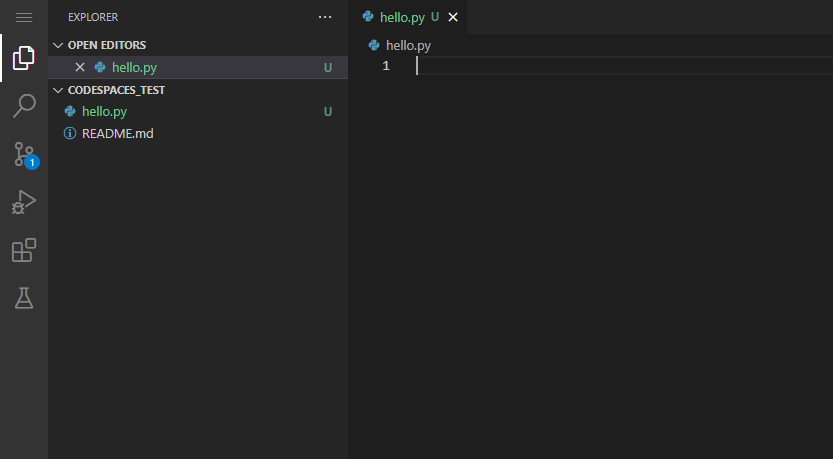
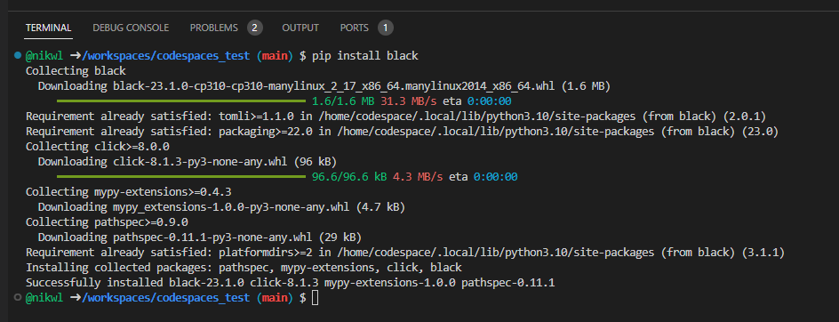

# cs473

Template code for the machine learning unit of the cs474/cs573 computer vision course at Clarkson University. This repository provides a script to download the training data and template files that you can use to help with training (though you're not required to use them).

## Setup Instructions

We're going to use GitHub codespaces for coding a code execution.
1) If you don't already have one, register for a [GitHub account](https://github.com/). 
2) Create a new private GitHub repository.
3) Create a new codespace by visiting [this page](https://github.com/codespaces).
4) Click "New codespace" at the top right.
5) Create a new codespace with your private GitHub repository as the source repo. 

You should now have access to your own codespace with a file explorer and terminal. [More about GitHub codespaces.](https://docs.github.com/en/codespaces/getting-started/quickstart)

## Hello world

Create a new file called `hello.py`.


Create your hello world codeblock.
```python
print("hello world!")
```

Execute your code in the terminal
```bash
@nikwl ➜ /workspaces/codespaces_test (main) $ hello.py 
hello world!
```

Install new dependencies using `pip install`.

