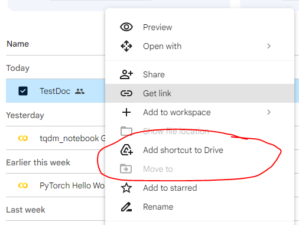

# Assignment 5: Deep Learning for Computer Vision

Homework assignment for the deep learning section of Computer Vision. 

See also the tutorials on [virtualenv](virtualenv.md) and [codespaces](codespaces.md).

## Overview

For this assignment, you will explore creating a deep neural network for classification of CIFAR-10. Deep convolutional neural networks (CNNs) are increasingly used for a variety of tasks, from biometric authentication to image-to-text recognition. Widespread interest has driven the creation of machine learning libraries that make creating new CNNs accessible, even with minimal coding experience. For this project we will use `pytorch` to design, train, and evaluate a CNN to perform a simple classification task on [CIFAR-10](https://www.cs.toronto.edu/~kriz/cifar.html). 

The CIFAR-10 dataset consists of 60,000 32x32 color images that cover 10 common classes: airplanes, automobiles, birds, cats, deer, dogs, frogs, horses, ships, and trucks. A snapshot of some images from the dataset is shown below.


## Deliverable

For this assignment, you will train a performant CNN-based classifier on CIFAR-10 by performing a grid search over two variables that impact network performance. Some examples of variables you can play with are: 

- Learning Rate 
- Batch Size
- Optimizer
- Number of network layers
- Number of convolutional kernals
- Network structure (adding more dropout layers, adding batch normalization, etc.)
- Data augmentation (cropping, standardization, etc.)

Your submission should be a zip file that contains:

1) [40%] Code for training and testing your network. Code can be distributed over multiple files or contained in a single file. The file(s) must be a python script, i.e. a `something.py` file. You can generate a python script from a Colab notebook by going to `File > Download > Download .py`.
2) [10%] Your trained model file, named `model.pt`.
3) [50%] A pdf or markdown (`.md`) report explaining the following:
    - How you split the data into train and validation sets.
    - Which variables you tested and what their impact on performance was.
    - A summary of your final network configuration and its accuracy on the validation set (best configuration of variables).
    - Instructions on how to load your model file.
    - Visualize a few model predictions that were correct, and a few that were incorrect. Does anything stand out about the incorrect predictions?
4) If you trained your model locally (not using Colab), include a `requirements.txt` file with the packages you used for your virtual environment. I should be able to install this using `pip install -r requirements.txt`.

## NOTES

### Data Description

You'll be provided with a copy of the dataset in a single pkl file, uploaded to google drive. The dataset contains 48,000 images and 48,000 filenames. The image labels need to be extracted from the filenames. The filenames contain some metadata, a monotonically increasing index, and the class that the image belongs to (the label). The metadata, index, and label are separated by an underscore, i.e. the filenames are specified as:

```python
f"{metadata} {index}_{label}.png"
```

For example, an image named "Image00001 100_0.png" would have a class label of "0".

[This link](https://drive.google.com/file/d/1zDci_KK8FEiln1bNCX4zlD8FUsTlH5XA/view?usp=sharing) will allow you to download the data (if you're using your machine) or add the data file to your google drive (if you're using Colab).

If you're feeling especially adventurous, you can also use gdown.
```bash 
gdown 1zDci_KK8FEiln1bNCX4zlD8FUsTlH5XA
```

### Mounting the Google Drive Folder

I'll share access to a google drive folder that contains the data. You can either download the file if you'd like to train locally, or you can access the shared file in Colab. To access the shared file in Colab, first add the shared file to your google drive:



Then mount the google drive folder in Colab using the following code snippet:
```python
import os
from google.colab import drive
drive.mount('/content/drive')
print(os.listdir('/content/drive/MyDrive'))
```

### Data preparation

Once you load the data, you need to split the data into a train and validation set. How you do this is up to you. Use your validation set to evaluate your choice of network structure and hyperparamters. I would suggest an 80%/20% train/validation split. I have a separate test set that I will use to evaluate your submitted model.

NOTE: The data is structured such that if you just load it and start training, your loss is unlikely to converge. If you're encountering this problem, visualize the data and labels and see if you notice a pattern that might hinder convergence.

### Evaluation

Evaluating model performance will require you to pick a performance metric that allows you to compare different experiments. Though the loss is easy to optimize, using the loss as a performance metric is not always the best choice. Here are some other classification metrics that would be worth investigating:

- Accuracy
- True Positive Rate (TPR)
- Precision
- Recall

Wikipedia provides a nice summary of [Precision and Recall](https://en.wikipedia.org/wiki/Precision_and_recall). [TorchMetrics](https://torchmetrics.readthedocs.io/en/stable/pages/quickstart.html) provides a bunch of tensor-optimized metric implementations.
```python
!pip install torchmetrics
import torchmetrics
```
